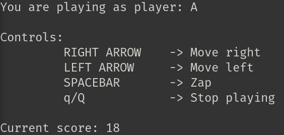
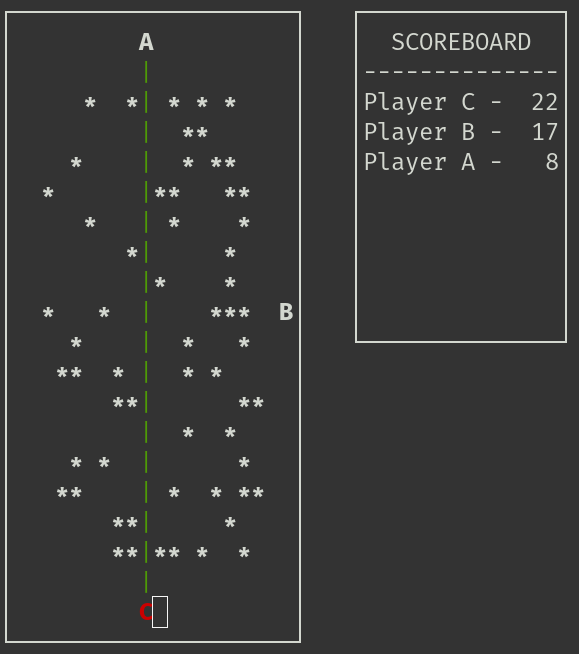

# Space Invaders Game

A C-based replica of a simple Space Invaders game, divided into three programs:

1. **game-server**: The server component of the game, responsible for receiving requests and managing the game state.
2. **astronaut-client**: The client component that controls the astronaut in the game.
3. **outer-space-display**: Displays the game state from the server's perspective (outer space and scoreboard without managing state), allowing remote clients to observe and play.

Below are examples of the game in action, showing the client and server sides. Here:
- `*` represents the aliens.
- Letters represent the players.
- The green line is the zap. 
- A red letter indicates that the player has been stunned.





## How To Play

### Prerequisites

Ensure the following tools are installed:

- [GCC](https://gcc.gnu.org/) or a similar compiler for building the project.
- [ZeroMQ](https://zeromq.org/) for communication between components.
- [Ncurses](https://invisible-island.net/ncurses/ncurses.html) for the graphical interface.

### Compilation

From the project's root directory, run:

```bash
make
```

_Note: Optionally, you can clean the project before building by running `make clean`._

### Starting the Game

After compiling the executables, start the components for example in the following order from the project's root directory:

1. Launch the game server: 

```bash
./run/game-server
````

2. Run up to 8 astronaut clients:

```bash
./run/astronaut-client
````

3. Optionally, start additional display modules:

```bash
./run/outer-space-display
```

## Project Structure

The project is organized into the following folders:

- `bin/`: Contains the compiled object files.
- `include/`: Contains the header files.
- `run/`: Contains the executable files.
- `src/`: Contains the source code, organized as follows:
    - `astronaut-client/`: Source code for the astronaut-client program.
    - `common/`: Source code shared between components.
    - `game-server/`: Source code for the game-server program.
    - `outer-space-display/`: Source code for the outer-space-display program.