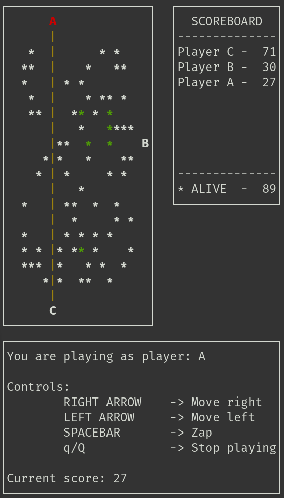
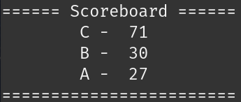

# Space Invaders Game

A C-based replica of a simple Space Invaders game, divided into 5 programs:

1. **game-server**: The server component of the game, responsible for receiving requests and managing the game state.
2. **astronaut-client**: The client component that controls the astronaut in the game.
3. **outer-space-display**: Displays the game state from the server's perspective (outer space and scoreboard without managing state), allowing remote clients to observe and play.
4. **astronaut-display-client**: Combines **astronaut-client** and **outer-space-display** into a single terminal application.
5. **space-high-scores**: Simple scoreboard tracker made in Python that listens for broadcasted messages from the C applications using ZeroMQ and Protocol Buffers.

Below is an example of **astronaut-display-client**. Where:
- `*` represents the aliens (color green means those aliens were regenerated due to no alien being killed during a certain interval).
- Letters represent the players.
- The yellow line is the zap. 
- A red letter indicates that the player has been stunned.

The **game-server** and **outer-space-display** only show the top part (game board and scoreboard), while the **astronaut-client** only shows the bottom part (player controls and score).



The **space-high-scores** application only shows the following basic scoreboard:




## How To Play

### Prerequisites

Ensure the following tools are installed:

- [GCC](https://gcc.gnu.org/) for building the project.
- [ZeroMQ](https://zeromq.org/) for communication between components.
- [Ncurses](https://invisible-island.net/ncurses/ncurses.html) for the graphical interface.
- [Protocol Buffers](https://protobuf.dev/) for packing messages between C and Python.

### Compilation

From the project's root directory, run:

```bash
make
```

_Note: Optionally, you can clean the project before building by running `make clean`._

### Starting the Game

After compiling the executables, start the components for example in the following order from the project's root directory:

1. Launch the game server: 

```bash
./run/game-server
````

2. Run up to 8 astronaut clients:

Without display:

```bash
./run/astronaut-client
````

With display:

```bash
./run/astronaut-display-client
````

3. Optionally, start additional display modules:

```bash
./run/outer-space-display
```

4. Also optionally, start the additional Python scoreboard display modules:

```bash
python3 src/space-high-scores/space_high_scores.py
```

_Note: Don't forget to install the required Python libraries defined in `src/space-high-scores/requirements.txt`._


## Project Structure

The project is organized into the following folders:

- `bin/`: Contains the compiled object files.
- `images/`: Contains image examples used in this README.
- `include/`: Contains the header files.
- `run/`: Contains the executable files.
- `src/`: Contains the source code, organized as follows:
    - `astronaut-client/`: Source code for the astronaut-client program.
    - `astronaut-display-client/`: Source code for the astronaut-display-client program.
    - `common/`: Source code shared between components.
    - `game-server/`: Source code for the game-server program.
    - `outer-space-display/`: Source code for the outer-space-display program.
    - `proto/`: Files related to the Protocol Buffers definitions.
    - `space-high-scores/`: Source code of the Python scoreboard application.